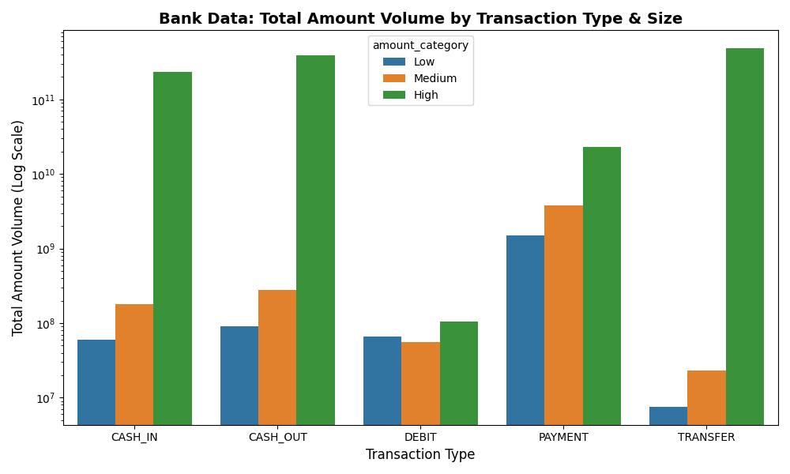
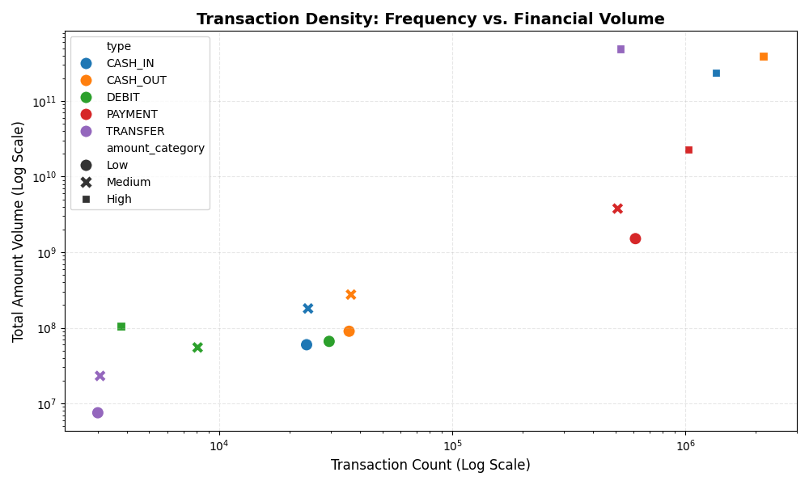
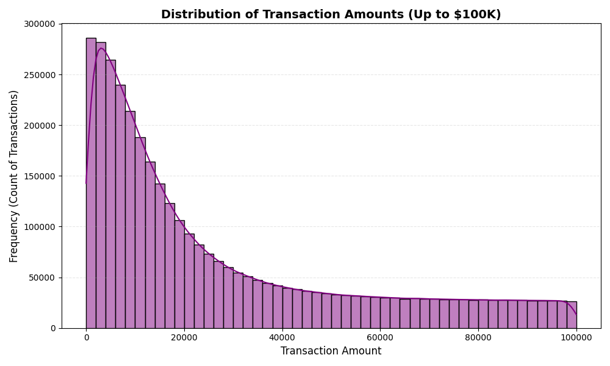

# Financial-Fraud-Analytics
An end-to-end Python data pipeline built with Pandas and Seaborn to clean, segment, and visualize millions of financial transactions. Features dynamic multi-variable binning (pd.cut), automated data cleaning, and custom logarithmic-scale charts (bar, histogram, scatter) to map operational risk and capital density.

# Financial Fraud Analytics: Multi-Variable Transaction Pipeline

A production-grade Python data engineering and visualization pipeline designed to parse, clean, and analyze millions of mobile money logs. This project utilizes **Pandas** for high-performance data vectorization and discretization matrices, paired with **Seaborn** and **Matplotlib** for logarithmic scale density visualization.

---

## 🚀 Core Features & Pipeline Architecture

1. **Defensive Environment Design:** Implemented OS-level check constraints to validate local database file paths gracefully before execution.
2. **Data Vectorization & Cleaning:** Programmed automated data cleansing parameters to drop duplicate log records dynamically while forcing strict float-precision decimal alignment.
3. **Statistical Discretization:** Utilized `pd.cut()` interval operations to segment raw numeric values safely into discrete transaction brackets (`Low`, `Medium`, `High`) spanning micro-capital up to macro-institutional volumes.
4. **Multi-Variable Aggregation:** Built robust `.groupby()` multi-index pipelines to evaluate frequency volumes, total cash velocity, and ticket-size means across multiple transactional intersections simultaneously.
5. **Logarithmic Scale Visualizations:** Integrated custom Seaborn structures to display highly skewed financial metrics across bar charts, distribution histograms, and coordinate scatter plots without visual distortion.

---

## 📊 Analytical Insights & Visualizations

### 1. Total Capital Volume Distribution (Grouped Bar Chart)
This visualization applies a logarithmic scale to isolate total revenue velocity across varying transaction profiles. It proves that while retail payment types drive massive infrastructure use, high-tier institutional operations run the absolute majority of capital transfer value.



### 2. Operational Density Map (Scatter Plot)
By mapping transaction counts directly against total cash movement on a dual log-coordinate plane, this chart effectively isolates capital risk profiles—grouping safe retail transactions at the baseline while highlighting macro-transfers at the apex.



### 3. Core Traffic Velocity (Histogram Distribution)
By systematically filtering out extreme multi-million dollar outliers, this distribution curve isolates the exact peak frequency behavior of standard user accounts on the platform.



---

## 🛠️ Tech Stack & Setup Instructions

* **Language:** Python
* **Libraries:** Pandas, NumPy, Matplotlib, Seaborn

### How To Run the Pipeline Locally

1. Clone this repository to your local system environment:
   ```bash
   git clone https://github.com/sky-000/Financial-Fraud-Analytics

2. Download the data file from the kaggle :
   ```bash
   https://www.kaggle.com/datasets/sriharshaeedala/financial-fraud-detection-dataset
 
